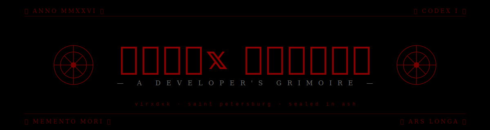

<div align="center">



<br/>

*"Vita brevis, ars longa, occasio praeceps, experimentum periculosum, iudicium difficile."*

<br/>

</div>

---

```
╔══════════════════════════════════════════════════════════════════╗
║                                                                  ║
║     ⸸   𝕮 𝕺 𝕯 𝕰 𝕩   𝕸 𝕺 𝕽 𝕿 𝕴 𝕾   ⸸                       ║
║                                                                  ║
║     a developer's grimoire — sealed, indexed, signed in ash      ║
║                                                                  ║
╚══════════════════════════════════════════════════════════════════╝
```

## `// VESSEL`

```
> NAME      :: John Dee
> CIPHER    :: virxdxk
> ANCHORED  :: Saint Petersburg / 59.93°N
> AGE       :: XX winters
> CRAFT     :: Software Engineer · ITMO Initiate
> STATE     :: awake. always.
```

---

## `// ARSENAL`

**Languages**


**Frameworks · Vectors of attack**


**Crypts · Where data sleeps**


**Forges · Tools of conjuration**


---

## `// SANCTUM`

```
┌─ CURRENT INVOCATIONS ──────────────────────────────────────────┐
│                                                                │
│  ⫷  building services that outlive their authors               │
│  ⫷  studying systems below the syscall                         │
│  ⫷  refining the craft until refinement becomes a curse        │
│                                                                │
└────────────────────────────────────────────────────────────────┘
```

---

## `// SIGILS`

<div align="center">


</div>

---

## `// CRYPT`

```
the buried, the abandoned, the consecrated:
```

| Year | Vessel        | State       |
| ---- | ------------- | ----------- |
| ████ | `redacted`    | sealed      |
| ████ | `redacted`    | dormant     |
| ████ | `redacted`    | consecrated |

*Replace with real repo links, or leave redacted for tone.*

---

## `// SUMMON`

[](mailto:didzon87@gmail.com)
[](https://github.com/virxdxk)
[](https://t.me/)

---

<div align="center">

```
                          ⸸
            ─── memento mori, et codice ───
                          ⸸
```


</div>
